# iOSAppHook [](http://github.com/Urinx/iOSAppHook) [](http://github.com/Urinx/iOSAppHook/fork)  [](https://github.com/Urinx/iOSAppHook/releases)
专注于非越狱环境下iOS应用逆向研究，从dylib注入，应用重签名到App Hook。

> 注意！本文所有操作均在以下环境下成功进行，不同平台或环境可能存在某些问题，欢迎大家在[issue](https://github.com/Urinx/iOSAppHook/issues)中提出问题以及相互讨论。
> 
> Mac OS X 10.11.6 (15G12a) - macOS Sierra 10.12.4 (16E144f)<br>
> Xcode 7.3.1 (7D1014) - 8.1 (8B62) <br>
> iPhone 5s, iOS 9.3.3 (13G21) - iOS 10.3 (14E5230e) <br>
> 免费开发者账号 <br>
> 示例App：微信 6.3.19.18 - 6.5.4

## 目录
* [前言](#前言)
* [应用脱壳](#应用脱壳)
* [应用重签名](#应用重签名)
* [安装iOSOpenDev](#安装iOSOpenDev)
* [App Hook](#App Hook)
* [一个简单的CaptainHook载入Cycript](#一个简单的CaptainHook载入Cycript)
* [使用Reveal调试微信的App界面](#使用Reveal调试微信的App界面)
* [后续](#后续)
* [常见问题](#常见问题)
* [参考链接](#参考链接)

## 前言
提到非越狱环境下`App Hook`大家早就已经耳熟能详，已经有很多大神研究过，这方面相关的资料和文章也能搜到很多。我最早是看到乌云知识库上[蒸米](http://drops.wooyun.org/author/蒸米)的文章才对这方面有所了解，当时就想试试，整个过程看似简单（大神总是一笔带过），然而当自己真正开始动手时一路上遇到各种问题（一脸懵逼），在[iOSRE论坛](http://bbs.iosre.com)上也看到大家遇到的各种问题，其实阻扰大家的主要是一些环境的搭建以及相关配置没设置好，结果导致dylib编译过程各种错误，重签名不成功，各种闪退等。所以本文里的每一步操作都会很详细的交代，确保大家都能操作成功。

## 应用脱壳
我们知道，App Store里的应用都是加密了的，直接拿上来撸是不正确的，所以在此之前一般会有这么一个砸壳的过程，其中用到的砸壳工具就是[dumpdecrypted](https://github.com/stefanesser/dumpdecrypted)，其原理是让app预先加载一个解密的dumpdecrypted.dylib，然后在程序运行后，将代码动态解密，最后在内存中dump出来整个程序。然而砸壳是在越狱的环境下进行的，鉴于本文主要关注点在非越狱环境下，再者我手里也没有越狱设备（有就不会这么蛋疼了）。

所以这里我们选择的是直接从PP助手等各种xx助手里面下载，注意的是这里下载的是越狱应用（不是正版应用），也就是所谓的脱过壳的应用。

为了谨慎起见，这里我们还需要确认一下从xx助手里下载的应用是否已解密，毕竟有好多应用是只有部分架构被解密，还有就是Watch App以及一些扩展依然加密了，所以最好还是确认一下，否则的话，就算hook成功，签名成功，安装成功，app还是会闪退。

首先，找到应用对应的二进制文件，查看包含哪些架构：
```
> file WeChat.app/WeChat
WeChat.app/WeChat: Mach-O universal binary with 2 architectures
WeChat.app/WeChat (for architecture armv7):	Mach-O executable arm
WeChat.app/WeChat (for architecture arm64):	Mach-O 64-bit executable
```
可以看到微信包含两个架构，armv7和arm64。关于架构与设备之间的对应关系可以从[iOS Support Matrix](http://iossupportmatrix.com)上查看。理论上只要把最老的架构解密就可以了，因为新的cpu会兼容老的架构。

`otool`可以输出app的load commands，然后通过查看cryptid这个标志位来判断app是否被加密。1代表加密了，0代表被解密了：
```
> otool -l WeChat.app/WeChat | grep -B 2 crypt
          cmd LC_ENCRYPTION_INFO
      cmdsize 20
     cryptoff 16384
    cryptsize 40534016
      cryptid 0
--
          cmd LC_ENCRYPTION_INFO_64
      cmdsize 24
     cryptoff 16384
    cryptsize 43663360
      cryptid 0
```
可以看到微信已经被解密了，第一个对应的是较老的armv7架构，后者则是arm64架构。

鉴于微信是一个多targets的应用，包含一个Watch App和一个分享扩展。所以同理，我们还需要依次确认以下二进制文件，这里就跳过了。
```
WeChat.app/Watch/WeChatWatchNative.app/WeChatWatchNative
WeChat.app/Watch/WeChatWatchNative.app/PlugIns/WeChatWatchNativeExtension.appex/WeChatWatchNativeExtension
WeChat.app/PlugIns/WeChatShareExtensionNew.appex/WeChatShareExtensionNew
```

## 应用重签名
在第二部分我们将要进行的是应用重签名，注意这里并不是按照整个操作流程的顺序来讲，而是跳过编译dylib，因为我觉得如果现在你没有把重签名拿下的话，写tweak写hook都是白搭。所以从这里在开始，我们不需要对App进行任何修改和处理，仅仅对其进行重签名，然后将其安装到设备上能够正常的运行。再次提醒的是重签名用的是脱壳后的App，加密的App重签名成功安到设备上也会闪退。

关于iOS应用重签名的文章有很多，签名方法都是一样，个别地方会有些小出入，然后按照里面给出的步骤手动一步一步的来操作，不知道是由于免费的开发者证书的原因还是哪一步漏掉了或者是什么其它的原因，总之就是不成功。就在一筹莫展的时候，偶然发现了一个名为[iOS App Signer](https://github.com/DanTheMan827/ios-app-signer)的Mac上的应用，这款重签名工具能够用免费的开发者账号重签名应用。我试了下，用这个工具重签名了一个应用，并且成功安装到手机上，尽管打开时闪退，但至少总算能安装到设备上去了。

看到签名成功心里一阵高兴，并且由于该应用开源，于是就到Github上阅读源码看其具体的实现。该应用是用Swift语音所写，代码量也不多，阅读起来没有问题。由于整个操作都是在终端下进行的，从终端到图形界面来回切换实在是麻烦，所以在其代码基础上稍作修改写了一个`Command Line Tool`工具在命令行下使用。

下面就来具体交代下这个重签名工具到底做了什么。

**1. 获取到本地上的开发者签名证书和所有的Provisioning文件**

获取本机上的Provisioning文件主要是调用了`populateProvisioningProfiles()`方法，该方法调用了`ProvisioningProfile.getProfiles()`将结果封装到`ProvisioningProfile`结构体中以数组的形式返回，并对其结果做了一个刷选，去掉了那些过期的证书。

```
struct ProvisioningProfile {
    ...
    static func getProfiles() -> [ProvisioningProfile] {
        var output: [ProvisioningProfile] = []
        
        let fileManager = NSFileManager()
        if let libraryDirectory = fileManager.URLsForDirectory(.LibraryDirectory, inDomains: .UserDomainMask).first, libraryPath = libraryDirectory.path {
            let provisioningProfilesPath = libraryPath.stringByAppendingPathComponent("MobileDevice/Provisioning Profiles") as NSString
            
            if let provisioningProfiles = try? fileManager.contentsOfDirectoryAtPath(provisioningProfilesPath as String) {
                for provFile in provisioningProfiles {
                    if provFile.pathExtension == "mobileprovision" {
                        let profileFilename = provisioningProfilesPath.stringByAppendingPathComponent(provFile)
                        if let profile = ProvisioningProfile(filename: profileFilename) {
                            output.append(profile)
                        }
                    }
                }
            }
        }
        return output
    }
    ...
}
```
简单点用shell表示就是，先列出所有的`~/Library/MobileDevice/Provisioning Profiles`路径下所有的后缀为`.mobileprovision`的文件，然后依次获取文件的信息（plist格式）。
```
security cms -D -i "~/Library/MobileDevice/Provisioning Profiles/xxx.mobileprovision"
```

获取开发者签名证书：
```
func populateCodesigningCerts() {
    var output: [String] = []
    
    let securityResult = NSTask().execute(securityPath, workingDirectory: nil, arguments: ["find-identity","-v","-p","codesigning"])
    if securityResult.output.characters.count >= 1 {
        let rawResult = securityResult.output.componentsSeparatedByString("\"")
        
        for index in 0.stride(through: rawResult.count - 2, by: 2) {
            if !(rawResult.count - 1 < index + 1) {
                output.append(rawResult[index+1])
            }
        }
    }
    self.codesigningCerts = output
    
    Log("Found \(output.count) Codesigning Certificates")
}
```
以上代码相当于：
```
> security find-identity -v -p codesigning
1) 1234567890123456789012345678901234567890 "iPhone Developer: XXX (xxxxxxxxxx)"
2) 1234567890123456789012345678901234567890 "Mac Developer: XXX (xxxxxxxxxx)"
```

**2. 一些准备工作**

创建临时目录，`makeTempFolder()`方法：
```
> mktemp -d -t com.eular.test
/var/folders/qr/8_n21zhd4f993khcsh_qll000000gp/T/com.eular.test.6aHPpdBZ
```

处理不同格式的输入文件，包括`deb`，`ipa`，`app`，`xcarchive`：
```
deb -> ar -x xxx.deb -> tar -xf xxx.tar -> mv Applications/ -> Payload/
ipa -> unzip -> Payload/
app -> copy -> Payload/
xcarchive -> copy .xcarchive/Products/Applications/ -> Payload/
```

**3. 重签名**

首先，复制provisioning文件到app目录里：
```
cp xxx.mobileprovision Payload/xxx.app/embedded.mobileprovision
```

根据provisioning文件导出entitlements.plist：
```
if provisioningFile != nil || useAppBundleProfile {
    print("Parsing entitlements")
                    
    if let profile = ProvisioningProfile(filename: useAppBundleProfile ? appBundleProvisioningFilePath : provisioningFile!){
        if let entitlements = profile.getEntitlementsPlist(tempFolder) {
            Log("–––––––––––––––––––––––\n\(entitlements)")
            Log("–––––––––––––––––––––––")
            do {
                try entitlements.writeToFile(entitlementsPlist, atomically: false, encoding: NSUTF8StringEncoding)
                Log("Saved entitlements to \(entitlementsPlist)")
            } catch let error as NSError {
                Log("Error writing entitlements.plist, \(error.localizedDescription)")
            }
        } else {
            Log("Unable to read entitlements from provisioning profile")
            warnings += 1
        }
        if profile.appID != "*" && (newApplicationID != "" && newApplicationID != profile.appID) {
            Log("Unable to change App ID to \(newApplicationID), provisioning profile won't allow it")
            cleanup(tempFolder); return
        }
    } else {
        Log("Unable to parse provisioning profile, it may be corrupt")
        warnings += 1
    }
    
}
```

修复可执行文件的权限：
```
if let bundleExecutable = getPlistKey(appBundleInfoPlist, keyName: "CFBundleExecutable"){
    NSTask().execute(chmodPath, workingDirectory: nil, arguments: ["755", appBundlePath.stringByAppendingPathComponent(bundleExecutable)])
}
```

替换所有Info.plist里的`CFBundleIdentifier`：
```
if let oldAppID = getPlistKey(appBundleInfoPlist, keyName: "CFBundleIdentifier") {
                        
    func changeAppexID(appexFile: String){
        
        func shortName(file: String, payloadDirectory: String) -> String {
            return file.substringFromIndex(payloadDirectory.endIndex)
        }
        
        let appexPlist = appexFile.stringByAppendingPathComponent("Info.plist")
        if let appexBundleID = getPlistKey(appexPlist, keyName: "CFBundleIdentifier"){
            let newAppexID = "\(newApplicationID)\(appexBundleID.substringFromIndex(oldAppID.endIndex))"
            print("Changing \(shortName(appexFile, payloadDirectory: payloadDirectory)) id to \(newAppexID)")
            
            setPlistKey(appexPlist, keyName: "CFBundleIdentifier", value: newAppexID)
        }
        if NSTask().execute(defaultsPath, workingDirectory: nil, arguments: ["read", appexPlist,"WKCompanionAppBundleIdentifier"]).status == 0 {
            setPlistKey(appexPlist, keyName: "WKCompanionAppBundleIdentifier", value: newApplicationID)
        }
        recursiveDirectorySearch(appexFile, extensions: ["app"], found: changeAppexID)
    }
    
    recursiveDirectorySearch(appBundlePath, extensions: ["appex"], found: changeAppexID)
}
...
```

然后对所有的`dylib`，`so`，`0`，`vis`，`pvr`，`framework`，`appex`，`app`以及`egg`文件用`codesign`命令进行签名。代码略长，此处不写。

**4. 打包**

最后将上述目录用zip打包成ipa文件就可以了。

**5. 安装ipa文件**

这里用到的是`mobiledevice`工具，执行下列命令安装ipa文件到手机上：
```
./mobiledevice install_app xxx.ipa
```
当然，你也可以使用`ideviceinstaller`工具。
```
./ideviceinstaller -i xxx.ipa
```

总之，上述步骤较多，主要集中在前4个步骤上，不建议自己操作，你可以选择使用图形界面的`iOS App Signer`应用，也可以使用我提供的根据其开源代码写的命令行工具，`AppResign`，你可以直接下载编译好的[二进制文件](https://github.com/Urinx/iOSAppHook/releases)。

使用方法：
```
./AppResign input out
```

这里以微信为例，我们一开始直接对其重签名，总是不成功，我猜问题主要在里面的Watch App上。于是乎便采取的最简单粗暴的方法，解压ipa文件，将`WeChat.app`里面的`Watch`文件夹，连同`PlugIns`文件夹一起删去。再用`AppResign`重签名，如图所示：

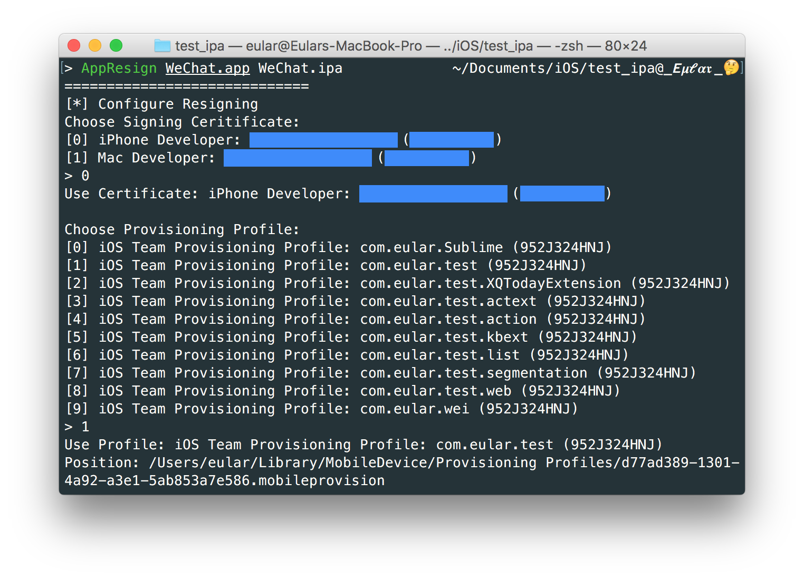

这时候将其安装到设备上，成功，并能够正常的打开。至此，这一步就大功告成了。

最后一点要注意的是，由于中国的开发者利用免费的证书大量对应用进行重签名，所以目前苹果加上了许多限制，免费开发者的provisioning证书有效时间从之前的30天改为7天，过期后需要重新签名。另外就是一个星期内最多只能申请到10个证书。

## 安装iOSOpenDev
如果上面的重签名步骤你能够成功的进行，接下来便开始考虑搭建编写dylib的越狱开发环境了。这里我们选择的是iOSOpenDev这个越狱开发平台工具，该工具集成到Xcode里面，提供了编写越狱应用插件的各种模版。所以下面就讲讲如何以正确的姿势安装iOSOpenDev。

一般一开始我们会去其官网上下载了一个pkg安装文件然后点击安装，结果一般会安装失败，接下来就开始尝试了各种姿势。其实那个pkg安装文件也没干啥，就是执行了一个iod-setup脚本，好吧于是就手工执行了这个脚本，发现其中下载github上的东西老是失败，然后翻了个墙，然后就好了。。。
```
sudo ./iod-setup base
sudo ./iod-setup sdk -sdk iphoneos
```

执行第二步会出现一个错误就是链接iOS 9.3的private framework失败，主要是在9.3的SDK里去掉了private framework。
```
PrivateFramework directory not found: /Applications/Xcode.app/Contents/Developer/Platforms/iPhoneOS.platform/Developer/SDKs/iPhoneOS9.3.sdk/System/Library/PrivateFrameworks
```

解决办法：

    1. 在[这里](https://jbdevs.org/sdks/)下载9.2的SDK。
    2. 解压后放到/Applications/Xcode.app/Contents/Developer/Platforms/iPhoneOS.platform/Developer/SDKs。
    3. 你可以把9.2里面的PrivateFrameworks文件夹复制到9.3对应的位置里path/to/iPhoneOS9.3.sdk/System/Library/。
    4. 或者是修改/Applications/Xcode.app/Contents/Developer/Platforms/iPhoneOS.platform/Info.plist文件，将`MinimumSDKVersion`改为9.2。
    5. 再次运行`sudo ./iod-setup sdk -sdk iphoneos`命令。

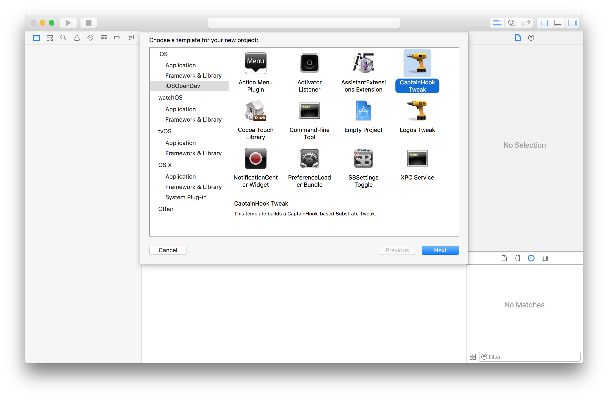

新建个CaptainHook连上设备编译一下，就可以发现编译成功了。

## App Hook
在这部分里，我们便开始动手编写dylib并将其注入到目标应用中。首先打开Xcode，新建一个项目，模版选择iOSOpenDev里的CaptainHook Tweak，项目名为hook。

删除hook.mm文件里的模版内容，替换为以下内容：
```
__attribute__((constructor)) static void entry() {
    NSLog(@"hello, world!");
}
```
`Cmd+B`编译，打开LatestBuild文件夹，得到编译好的dylib文件。

使用[yololib](https://github.com/KJCracks/yololib)工具对对二进制文件进行dylib的注入。
```
>./yololib WeChat.app/WeChat hook.dylib
2016-06-16 07:35:06.014 yololib[49519:642763] dylib path @executable_path/hook.dylib
2016-06-16 07:35:06.016 yololib[49519:642763] dylib path @executable_path/hook.dylib
Reading binary: WeChat.app/WeChat

2016-06-16 07:35:06.016 yololib[49519:642763] FAT binary!
2016-06-16 07:35:06.016 yololib[49519:642763] Injecting to arch 9
2016-06-16 07:35:06.016 yololib[49519:642763] Patching mach_header..
2016-06-16 07:35:06.016 yololib[49519:642763] Attaching dylib..

2016-06-16 07:35:06.016 yololib[49519:642763] Injecting to arch 0
2016-06-16 07:35:06.016 yololib[49519:642763] 64bit arch wow
2016-06-16 07:35:06.016 yololib[49519:642763] dylib size wow 56
2016-06-16 07:35:06.017 yololib[49519:642763] mach.ncmds 75
2016-06-16 07:35:06.017 yololib[49519:642763] mach.ncmds 76
2016-06-16 07:35:06.017 yololib[49519:642763] Patching mach_header..
2016-06-16 07:35:06.017 yololib[49519:642763] Attaching dylib..

2016-06-16 07:35:06.017 yololib[49519:642763] size 51
2016-06-16 07:35:06.017 yololib[49519:642763] complete!
```

注入成功后可以用MachOView程序查看整个MachO文件的结构，比如在`Load Commands`这个数据段里，可以看到`LC_LOAD_DYLIB`加载动态库。我们使用MachOView打开，可以看到已经被注入hook.dylib，如图所示。

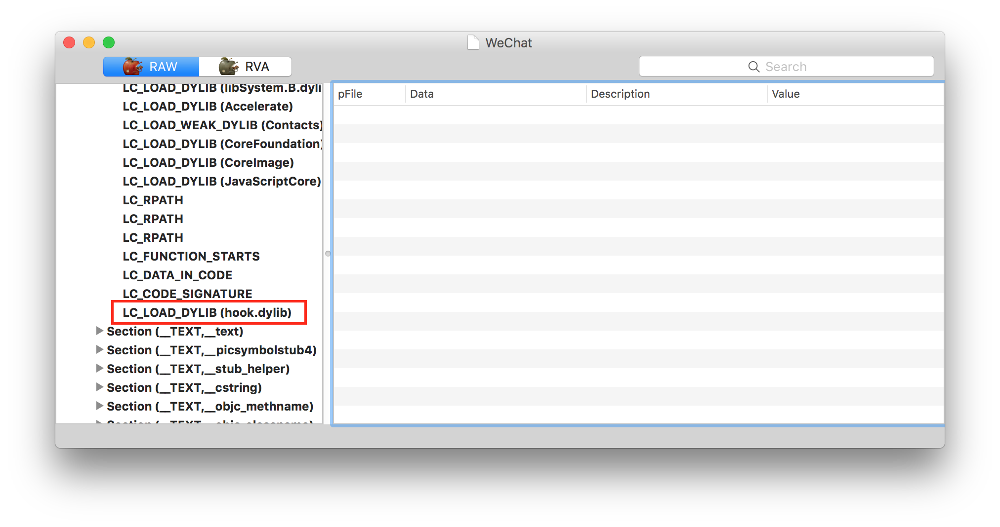

别忘了，我们还需要将我们注入的dylib文件放到WeChat.app目录下。
```
cp hook.dylib WeChat.app/
```

接下来就是之前的老套路了，先重签名然后安装到设备上。安装完后，我们用idevicesyslog查看log信息。在命令行中输入命令：
```
idevicesyslog
```
然后打开我们修改过的微信应用，可以看到如下图的log输出信息。

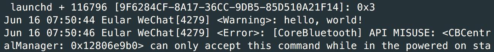

可以看到`hello, world!`成功输出，表示我们的dylib的代码已经能够执行。

## 一个简单的CaptainHook载入Cycript
当然不可能一个NSLog结束了，所以接下来我们将编写一个dylib来载入Cycript工具方便我们以后调试目标应用。

新建一个CaptainHook，项目名为loadCycript。首先，导入`Cycript.framework`，另外还需要导入其依赖的`JavaScriptCore.framework`，`libsqlite3.0.tbd`和`libstdc++.6.0.9.tbd`。

然后，在Build Settings里面的搜索bitcode，将`Enable Bitcode`选项设为`NO`。

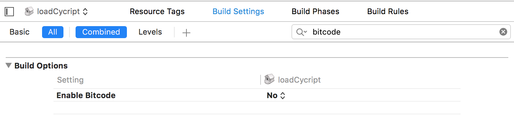

一开始编写loadCycript.mm文件的内容是这样的：
```
#import <Cycript/Cycript.h>
#import <CaptainHook/CaptainHook.h>

#define CYCRIPT_PORT 8888

CHDeclareClass(AppDelegate);
CHDeclareClass(UIApplication);

CHOptimizedMethod2(self, void, AppDelegate, application, UIApplication *, application, didFinishLaunchingWithOptions, NSDictionary *, options)
{
    CHSuper2(AppDelegate, application, application, didFinishLaunchingWithOptions, options);
    
    NSLog(@"## Start Cycript ##");
    CYListenServer(CYCRIPT_PORT);
}

__attribute__((constructor)) static void entry() {
    CHLoadLateClass(AppDelegate);
    CHHook2(AppDelegate, application, didFinishLaunchingWithOptions);
}
```
上述代码hook了AppDelegate里的`application:(UIApplication *)application didFinishLaunchingWithOptions:(NSDictionary *)`方法，在该方法里开启Cycript并绑定到8888端口。

编译该项目生成dylib文件，注入到微信App中，重签名后安装到手机里，然后在idevicesyslog输出的日志里看看有没有我们输出的信息，结果找了半天，嗯哼，还真没有。。。

问题出在哪了呢，难道是`application:(UIApplication *)application didFinishLaunchingWithOptions:(NSDictionary *)`这个方法没有hook成功吗？好吧，随后又试了试hook`applicationDidEnterBackground`等方法，结果没一个成功，然后就一脸懵逼了，此时第一反应就是不会没有`AppDelegate`这个类吧。

没办法，只有导出微信的头文件看看了。
```
class-dump -H -o header WeChat.app/WeChat
```
结果一看，还真没有(°_°)… 通过搜索关键字`AppDelegate`终于找到了其真身`MicroMessengerAppDelegate`，虽说穿了个马甲，但依然还是它。

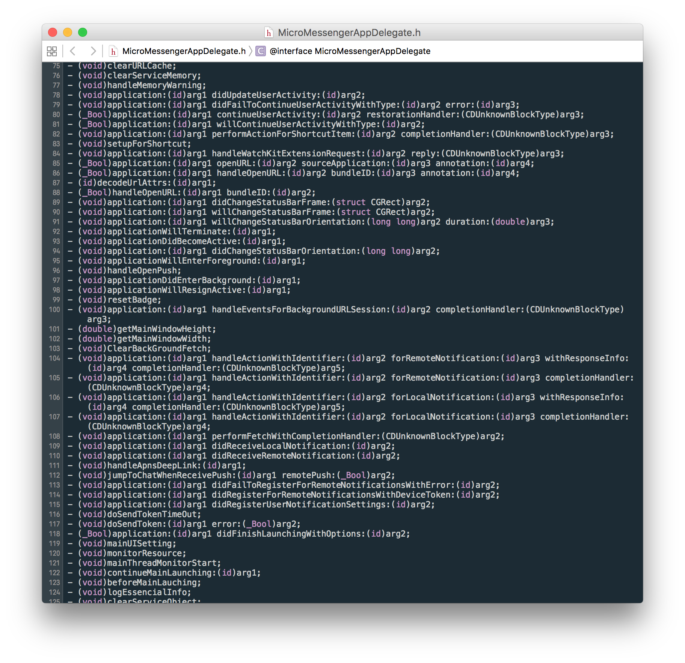

该有的方法都有，这样我就放心了。于是对之前的代码稍作修改就可以了。
```
#import <Cycript/Cycript.h>
#import <CaptainHook/CaptainHook.h>

#define CYCRIPT_PORT 8888

CHDeclareClass(UIApplication);
CHDeclareClass(MicroMessengerAppDelegate);

CHOptimizedMethod2(self, void, MicroMessengerAppDelegate, application, UIApplication *, application, didFinishLaunchingWithOptions, NSDictionary *, options)
{
    CHSuper2(MicroMessengerAppDelegate, application, application, didFinishLaunchingWithOptions, options);
    
    NSLog(@"## Start Cycript ##");
    CYListenServer(CYCRIPT_PORT);
}


CHConstructor {
    @autoreleasepool {
        CHLoadLateClass(MicroMessengerAppDelegate);
        CHHook2(MicroMessengerAppDelegate, application, didFinishLaunchingWithOptions);
    }
}
```
再跑一遍，这会我们就能在log日志里能看到Cycript成功开启的消息了。


我们用Cycript远程连上去调试看看，比如说修改发现页的tableView背景颜色。

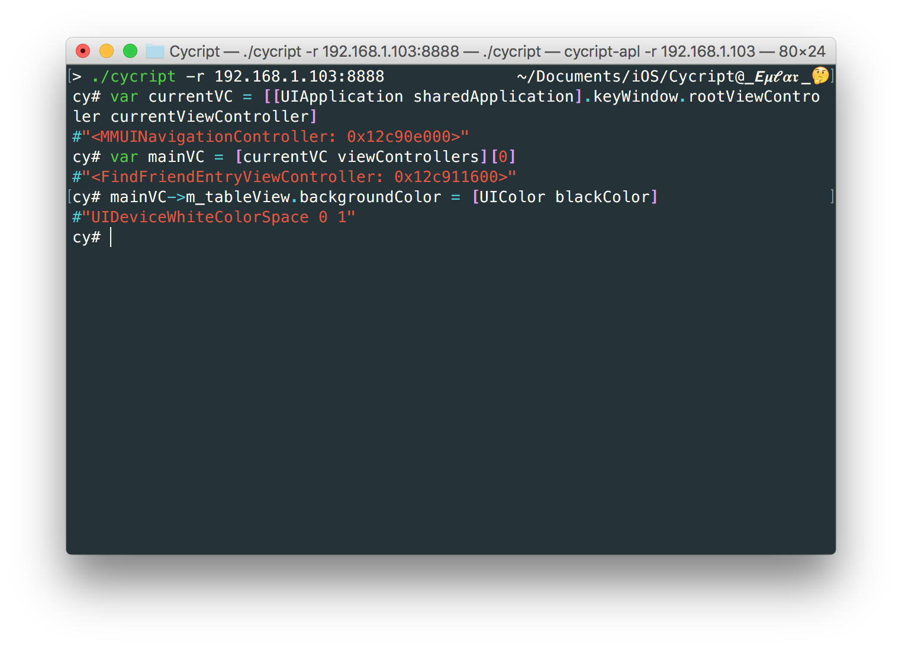

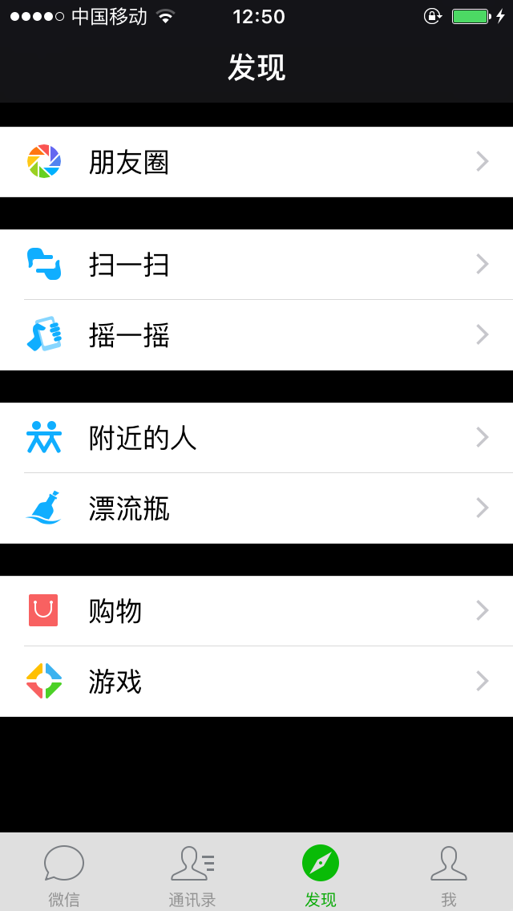

注：本文中用到的AppResign重签名工具，以及编译好的loadCycript.dylib可以在[这里](https://github.com/Urinx/iOSAppHook/releases)下载。

## 使用Reveal调试微信的App界面
Reveal这个调试应用UI界面的神器这里就不再介绍了，本文所有的相关资料都在参考链接里请自行查看。

首先从Reveal应用中找到提供的静态库文件。

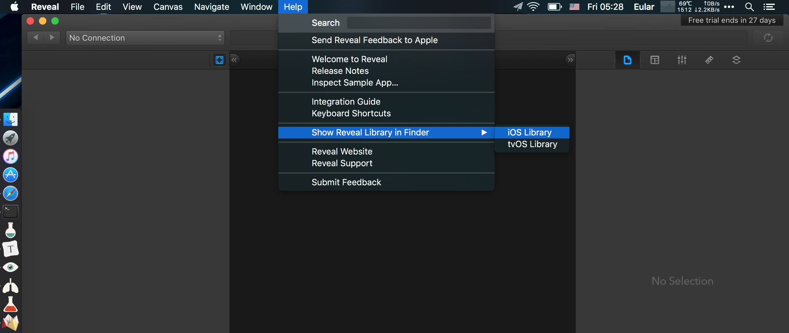

将`Reveal.framework`从`Build Phase`里面的`Link Binary`里面去掉，然后添加其它的相关依赖库: `UIKit.framework`，`CoreGraphics.framework`，`QuartzCore.framework`，`CFNetwork.framework`，`libz.tbd`。

接着在`Build Settings`里面搜索`Other Linker Flags`，将其设置为：
```
-ObjC -lz -framework Reveal
```

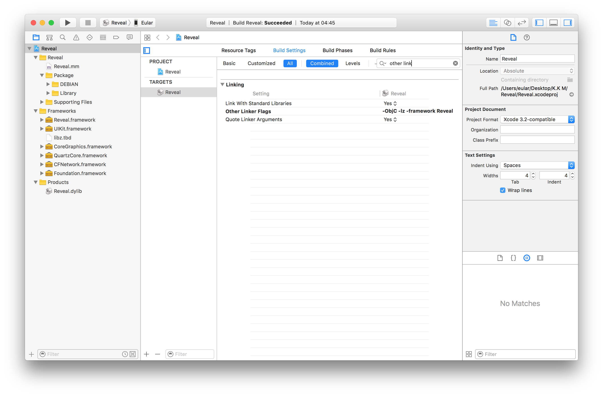

接下来编译项目就可以了，你甚至都不用写一句代码。编译好的dylib按照前面说的方法注入到微信App中，打开Reveal应用就可以连接上手机了。

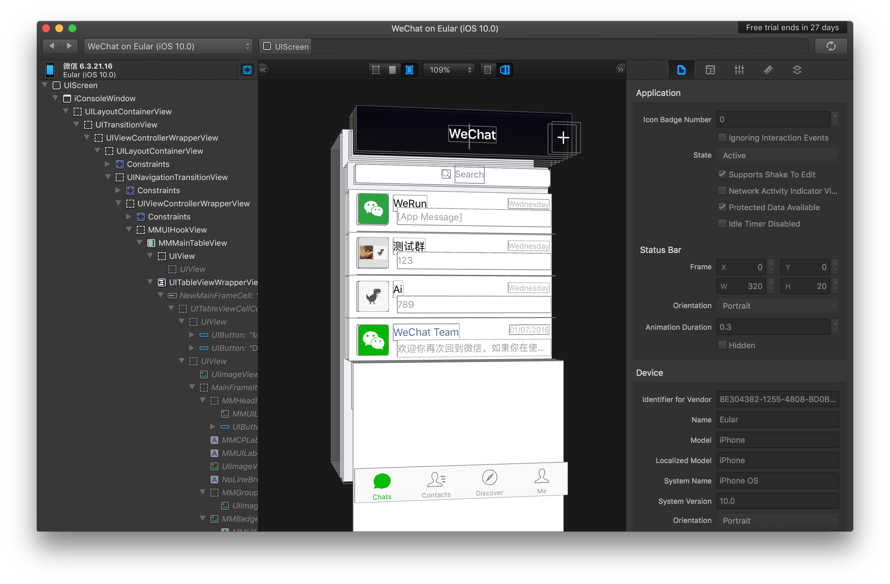

注：编译好的Reveal.dylib以及Cycript和Reveal结合的dylib都可以在[这里](https://github.com/Urinx/iOSAppHook/releases)下载。

## 后续
至于之后该做什么，你想干嘛就干嘛。Cycript在手，天下我有，Reveal一出，谁与争锋。你可以使用Class-dump工具dump出应用的头文件，或者是将二进制文件拖到ida或hopper里面反汇编分析，写tweak插件，实现各种姿势抢红包等等，本文就不讨论这些了。

## 常见问题

**1. Invalid or unsupported format for signature**

一般我们拿到越狱脱壳后的应用什么都不做直接重签名后时是可以成功安装的，然而一旦注入dylib之后再进行重签名时就可能遇到此错误，原因一般出在注入dylib过程中。

例如，在国内某助手的越狱应用商店上下载了一个`6.5.3`版本的微信，通过`file`命令可以看到可执行文件里还包含了一个奇葩的`x86_64`指令集（你确定这不是模拟器上跑的）：

```bash
> file WeChat.app/WeChat
WeChat.app/WeChat: Mach-O universal binary with 2 architectures: [arm_v7: Mach-O executable arm_v7] [x86_64]
WeChat.app/WeChat (for architecture armv7): Mach-O executable arm_v7
WeChat.app/WeChat (for architecture x86_64):    Mach-O 64-bit executable x86_64
```

挂上dylib后再重签名就报错了：

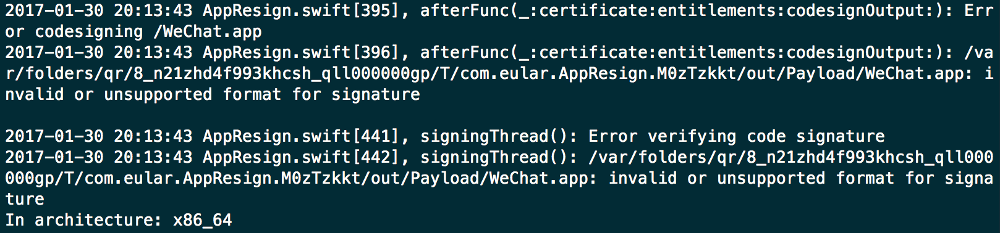

如果用`MachOView`软件看看是否注入成功，可以发现在`x86_64`上出错了。

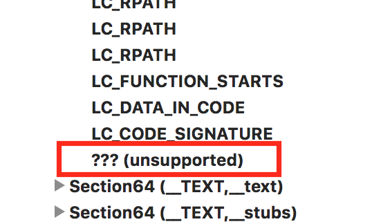

这个不能怪我咯，要怪只能怪`yololib`工具了。

**2. 应用只有一个指令集**

在重签名`3.4.0`版本的`Malody`应用时，通过`file`命令可以看到该执行文件只有一个`armv7`指令集：

```bash
> file Malody.app/Malody\ Mobile 
Malody.app/Malody Mobile: Mach-O universal binary with 1 architecture: [arm_v7: Mach-O executable arm_v7]
Malody.app/Malody Mobile (for architecture armv7):  Mach-O executable arm_v7
```

如果此时对其重签名则会报如下错误：

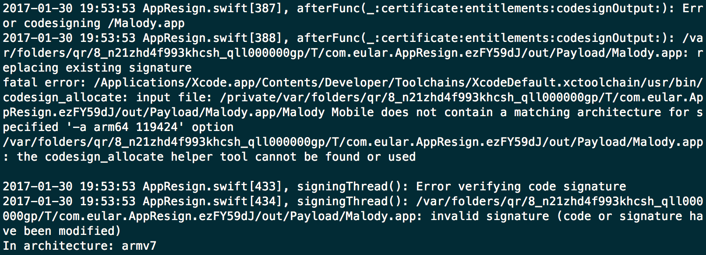

解决方法是在执行`codesign`命令时需要指定选项`-a armv7`，不然默认的参数是`--all-architectures`。此bug已修复，如遇到此问题，请使用最新版的AppResign。

## 参考链接
之前看的都没记录，下列都是后来想到才记下来的。

蒸米的iOS冰与火之歌系列：
- http://drops.wooyun.org/author/蒸米
- http://drops.wooyun.org/papers/12803
- http://drops.wooyun.org/papers/13824

微信重签名相关：
- https://testerhome.com/topics/4558
- http://www.jianshu.com/p/3f57d51f770a/comments/1757000
- http://iosre.com/t/topic/2966
- http://bbs.iosre.com/t/targets-app/2664/15

iOSOpenDev：
- https://github.com/wzqcongcong/iOSOpenDev
- http://www.aichengxu.com/view/6004431
- http://bbs.iosre.com/t/xcode7-iosopendev-iosopendev-ios9/1963
- http://bbs.iosre.com/t/xcode-7-3-ios-9-3-sdk-theos-private-framework/3200

Reveal
- http://blog.devzeng.com/blog/ios-reveal-integrating.html
- http://support.revealapp.com/kb/getting-started/integrating-reveal-with-your-ios-app
- https://github.com/QQVIPTeam/practice-of-ios/issues/10
- https://hurui.gitbooks.io/reveal-debug/content/noModify.html

其它：
- http://apple.stackexchange.com/questions/213440/remotely-distribute-an-ios-app-compiled-in-xcode-7-without-app-store-developer
- https://gist.github.com/chaitanyagupta/9a2a13f0a3e6755192f7
